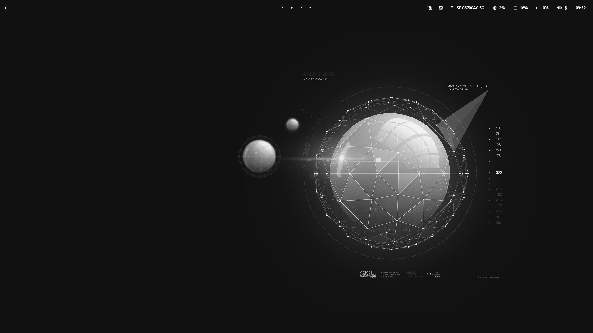
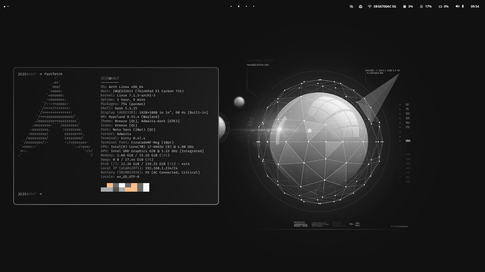
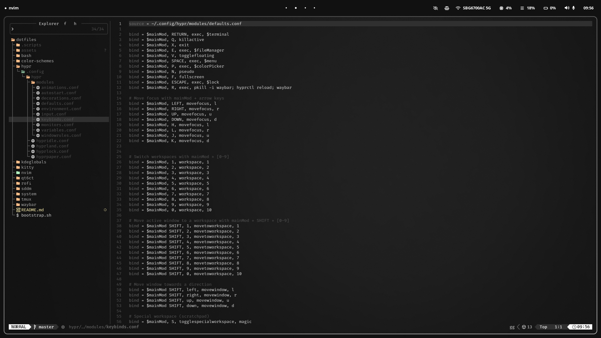

# hyoaru/dotfiles

Hyprland + LazyVim dotfiles on Arch. Everything is managed with
[GNU stow](https://www.gnu.org/software/stow/) and tied together with a single
unified `yugen` theme across the terminal, editor, and desktop.

> **Heads up:** this repo targets a **fresh Arch install**. `apply.sh` wipes
> `~/.config/hypr` with no backup, so don't run it over a setup you care about.





## Requirements

- Arch Linux (`pacman`-based)
- A few fonts used by the configs:
  - **FiraCode Nerd Font** — kitty terminal
  - **Noto Sans** — Hyprland UI / splash

`install.sh` covers the essentials, but the following are **not** installed by
the script and must be installed manually:

`hyprland` `kitty` `rofi` `waybar` `tmux` `dolphin` `playerctl` `fd` `xsel`

Plus [tpm](https://github.com/tmux-plugins/tpm) for tmux plugins
(`git clone https://github.com/tmux-plugins/tpm ~/.tmux/plugins/tpm`).

## Installation

```sh
git clone https://github.com/hyoaru/dotfiles.git ~/dotfiles
cd ~/dotfiles
./bootstrap.sh
```

`bootstrap.sh` runs two scripts:

| Script                | What it does                                                                                                                                                |
| --------------------- | ----------------------------------------------------------------------------------------------------------------------------------------------------------- |
| `.scripts/install.sh` | Installs packages with `pacman -S --needed` (shell, DE, and dev tooling).                                                                                   |
| `.scripts/apply.sh`   | Wipes `~/.config/hypr`, stows all configs, sets the dark color scheme, and installs the `where-is-my-sddm-theme` SDDM theme into `/usr/share/sddm/themes/`. |

## Structure

```
.
├── bootstrap.sh              # install.sh + apply.sh
├── .scripts/
│   ├── install.sh            # pacman packages
│   └── apply.sh              # stow + gsettings + SDDM theme
├── bash/
│   └── .bashrc               # Oh-My-Bash (tonotdo), fzf + bat + eza, aliases
├── hypr/
│   └── .config/hypr/
│       ├── hyprland.conf     # sources module files
│       ├── hyprlock.conf     # screen locker
│       ├── hyprpaper.conf    # wallpaper (uses ~/wallpapers)
│       ├── hypridle.conf     # idle / DPMS
│       └── modules/          # keybinds, monitors, decorations, windowrules...
├── kitty/
│   └── .config/kitty/        # kitty.conf + themes/yugen.conf, transparent
├── nvim/
│   └── .config/nvim/         # LazyVim-based, yugen colorscheme, Go LSP
├── rofi/
│   └── .config/rofi/         # drun launcher + main.rasi theme
├── sddm/
│   ├── sddm.conf             # /etc/sddm.conf
│   └── theme.conf            # where-is-my-sddm-theme override
├── system/
│   └── wallpapers/           # stowed to ~/wallpapers
├── tmux/
│   └── .tmux.conf            # prefix C-s, vi keys, tpm
└── waybar/
    └── .config/waybar/       # top bar: workspaces, sysinfo, battery
```

## Keybinds

### Hyprland (`SUPER` = mod)

| Keys                                       | Action                              |
| ------------------------------------------ | ----------------------------------- |
| `SUPER` + `RETURN`                         | Terminal (`kitty`)                  |
| `SUPER` + `Q`                              | Kill active window                  |
| `SUPER` + `X`                              | Exit session                        |
| `SUPER` + `E`                              | File manager (`dolphin`)            |
| `SUPER` + `V`                              | Toggle floating                     |
| `SUPER` + `SPACE`                          | Launcher (`rofi`)                   |
| `SUPER` + `P`                              | Color picker (`hyprpicker`)         |
| `SUPER` + `F`                              | Fullscreen                          |
| `SUPER` + `ESC`                            | Lock (`hyprlock`)                   |
| `SUPER` + `R`                              | Reload Hyprland + waybar            |
| `SUPER` + `arrows` / `HJKL`                | Move focus                          |
| `SUPER` + `SHIFT` + `arrows`               | Move window                         |
| `SUPER` + `1`–`0`                          | Switch workspace                    |
| `SUPER` + `SHIFT` + `1`–`0`                | Move window to workspace            |
| `SUPER` + `S`                              | Toggle scratchpad (`special`)       |
| `SUPER` + `SHIFT` + `S`                    | Move window to scratchpad           |
| `SUPER` + `scroll`                         | Cycle workspaces                    |
| `SUPER` + `LMB` / `RMB` (drag)             | Move / resize window                |
| `Print` / `CTRL`+`Print` / `SUPER`+`Print` | Screenshot region / window / screen |
| `XF86Audio*` / `XF86MonBrightness*`        | Volume, mic, brightness, media      |

### tmux (prefix `C-s`)

| Keys                        | Action                               |
| --------------------------- | ------------------------------------ |
| `C-s` `r`                   | Reload config                        |
| `C-s` `h` / `j` / `k` / `l` | Select pane left / down / up / right |
| `C-s` `%` / `"`             | Split pane vertically / horizontally |
| `C-s` `c`                   | New window                           |
| `C-s` `[`                   | Copy mode (vi keys, copy via `xsel`) |
